# Nutri

  

> Nutri is an web app created for people who want to learn more about their nutrition and the exercises they do.  

Live demo  
• [English](https://nutri-django.herokuapp.com/en/)  
• [Polish](https://nutri-django.herokuapp.com/pl/)

## Table of Contents
* [General Info](#general-information)
* [Technologies Used](#technologies-used)
* [Features](#features)
* [Screenshots](#screenshots)
* [Setup](#setup)
* [Usage](#usage)
* [Project Status](#project-status)
* [Room for Improvement](#room-for-improvement)
* [Acknowledgements](#acknowledgements)
* [Contact](#contact)
<!-- * [License](#license) -->

## General Information
Nutri is an app created for people who want to learn more about their nutrition and the exercises they do. 
It allows you to add the meals you have eaten and the exercises you have done during the day.
You can do this by searching for items manually, or create templates to do it more efficiently.

Nutri allows all users to enter exercises, ingredients or recipes that are not currently in the database.
This can be accomplished by filling out forms manually or by using a barcode (ingredient entry).  
The application tracks all changes in your body, that is, it allows you to enter measurements of your body, the changes of which can be visualized with dynamic graphs (daily, weekly, monthly and yearly)  

Visualization Examples  
1.
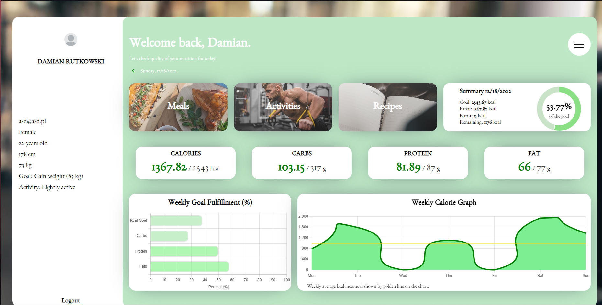
2.
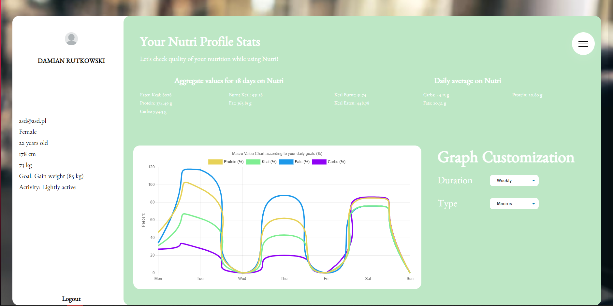

## Technologies Used
-  Python 3.10.4 &nbsp;
-  Django 4.1.2 &nbsp;
-  HTML5&nbsp;
-  SASS&nbsp;
-  CSS3&nbsp;
-  JavaScript ES6+&nbsp;
-  JavaScript ES6+&nbsp;
-  jQuery (Ajax Included)&nbsp;
### :hammer_and_wrench: Tools & Deployment:
-  PyCharm&nbsp;
-  MySQL (development)&nbsp;
-  Postgres (deployment)&nbsp;
-  Heroku (deployment)&nbsp;
-  AWS S3 (static files storage for deployment)&nbsp;
## Features
List the ready features here:
- Creating an account which is verified by mail activation link
- Adding meals manually or template based
- Adding workouts manually or template based
- Creating a meals/workouts templates
- Calculating user macro demands (kcal, carbs, fat, protein)
- Tracking daily income of macros
- Tracking measurements changes in time (monthly, yearly)
- Adding a ingredient/meal manually or using bar code search functionality which is not included in database
- Adding activities which are not included in database
- Searching for recipe by name and display its content
- Searching for recipe by ingredients ( 2 options of search)
- Adding your own recipe
- Visualization of the data
- Translating entered meals/ingredients/activities/recipes to both EN and PL language

## Screenshots
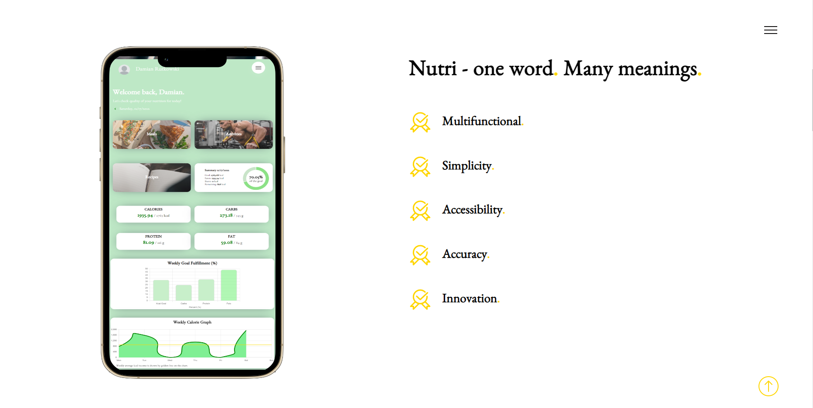
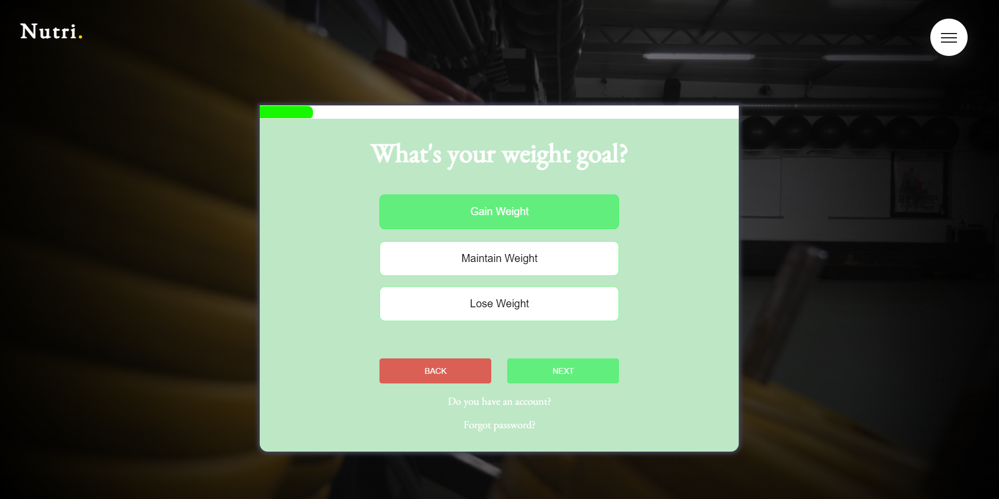
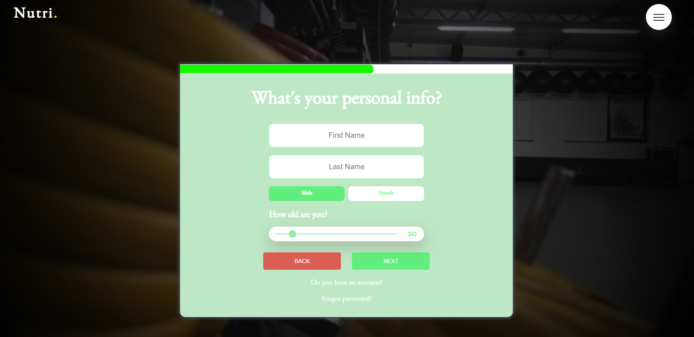
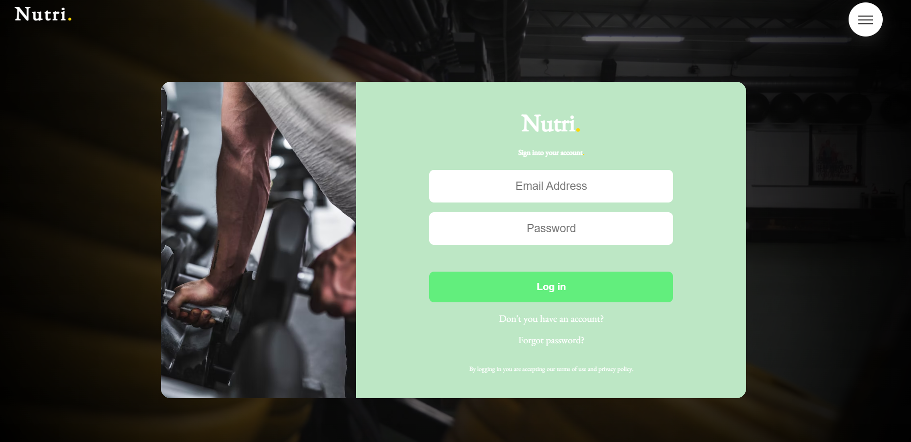

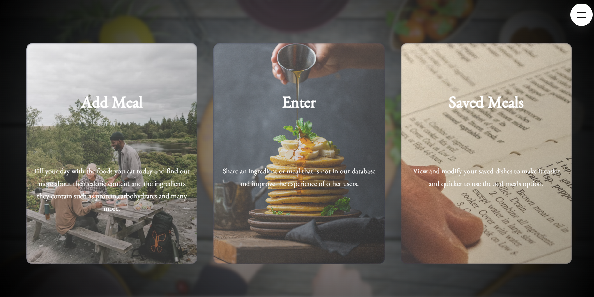
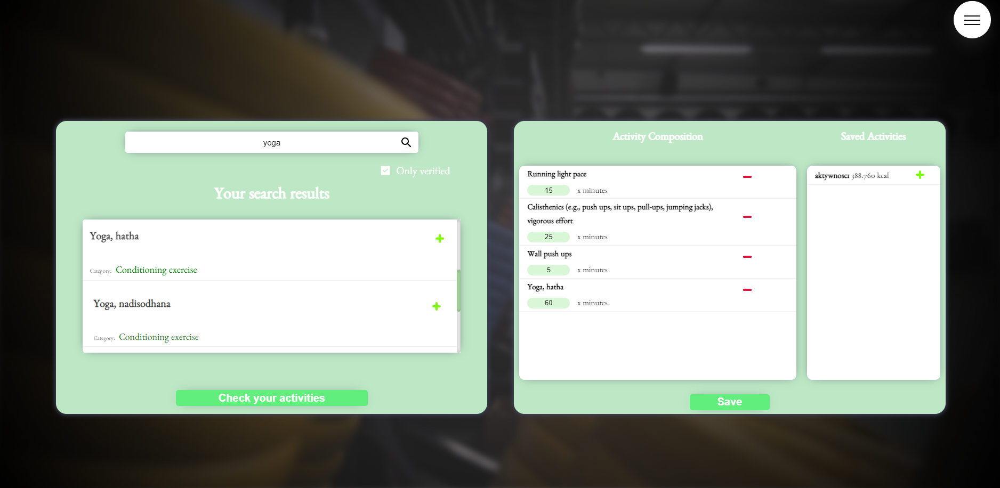
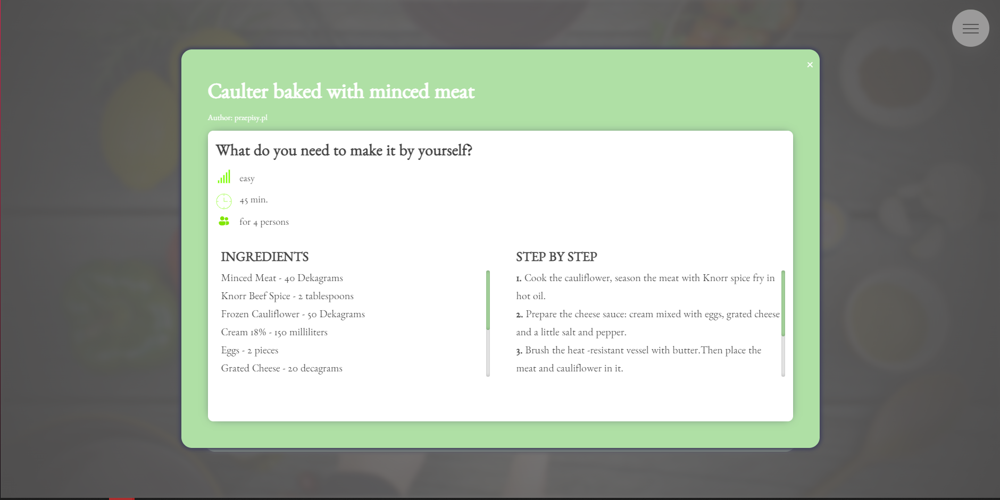
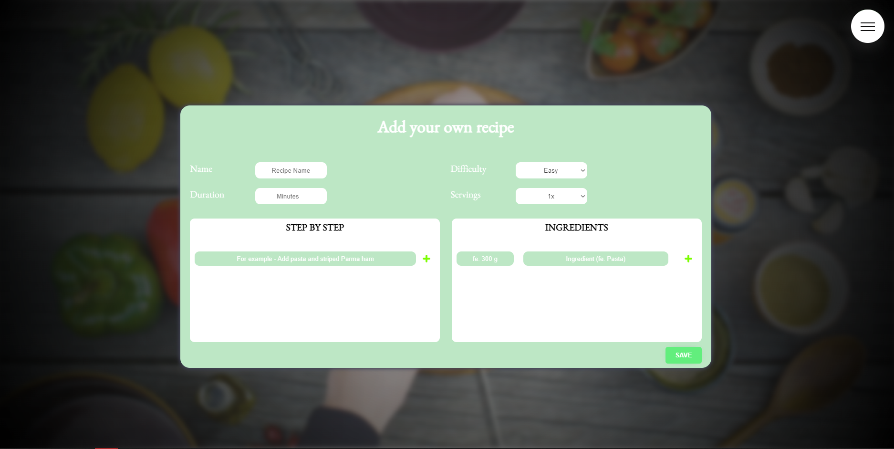
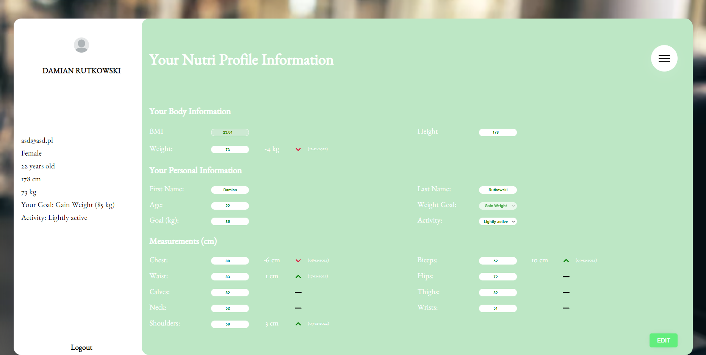

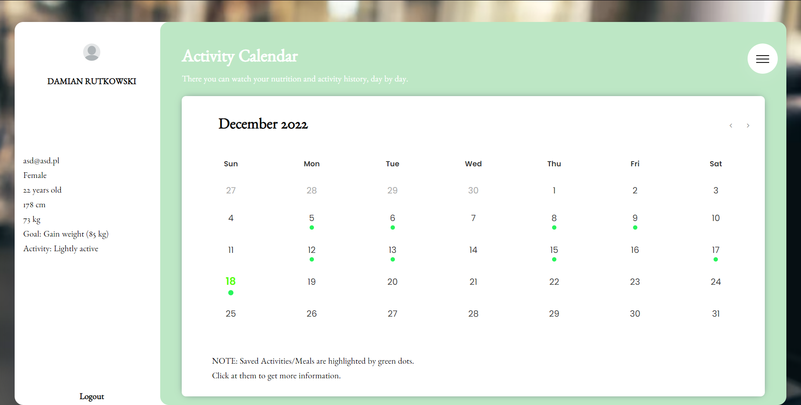
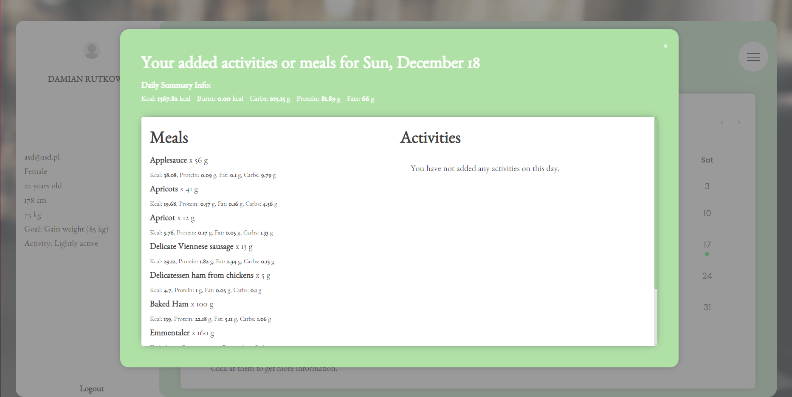
<!-- If you have screenshots you'd like to share, include them here. -->
... and many more!

## Setup
- Create New Folder
- Type 'git clone https://github.com/drutkoowski/Nutri-Django.git' into the console/git cli
- Then 'cd Nutri'
- Create Virtual Environment by typing 'python3 -m venv venv' (in some cases you might use python instead of python3)
- Install all required dependencies located in requirements.txt using 'pip install -r requirements.txt'
- Create '.env' file (variables required are located in env-sample)
- Run migrations by typing 'python manage.py makemigrations' and then 'python manage.py migrate'
- Finally run 'python manage.py runserver'

## Project Status
Project is: :fire: COMPLETED :fire:

## Improvements to be done
- Creating Meals/Workouts fitted suggestions
- Save for later functionality
- Mobile version of the application

## Contact
Created by Damian Rutkowski - feel free to contact me!

  
  
   
  
  
  

